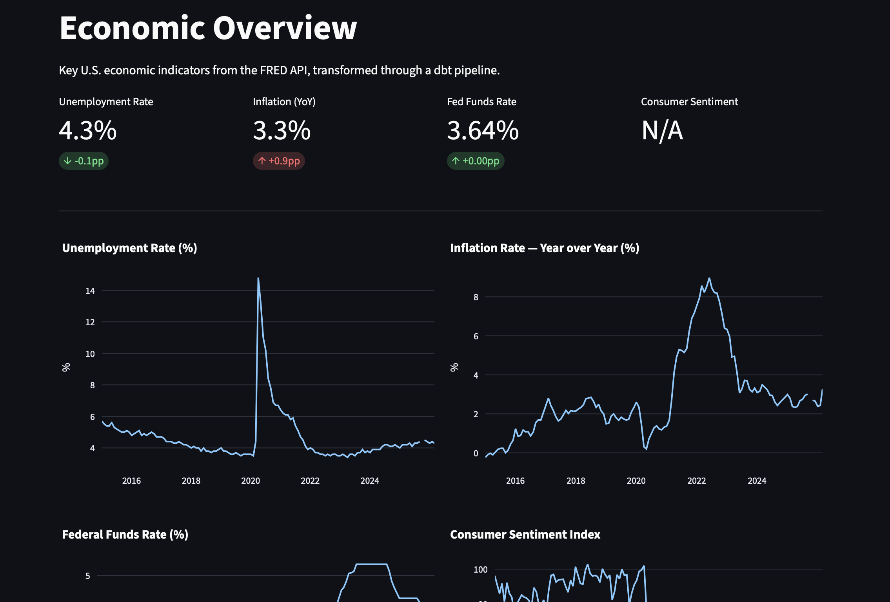
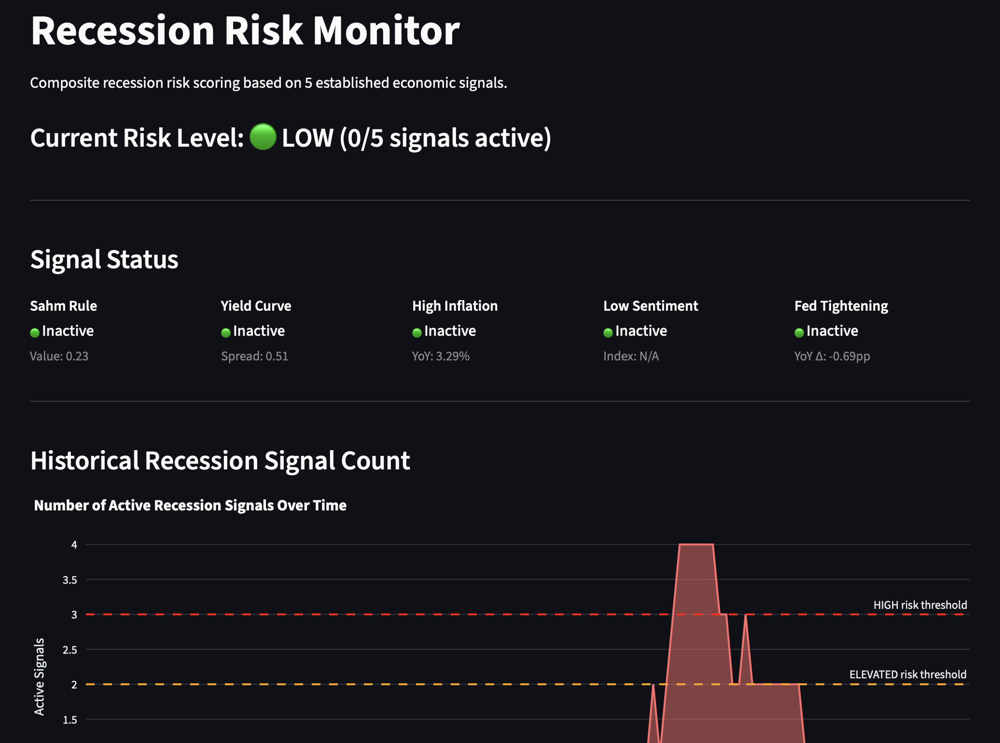
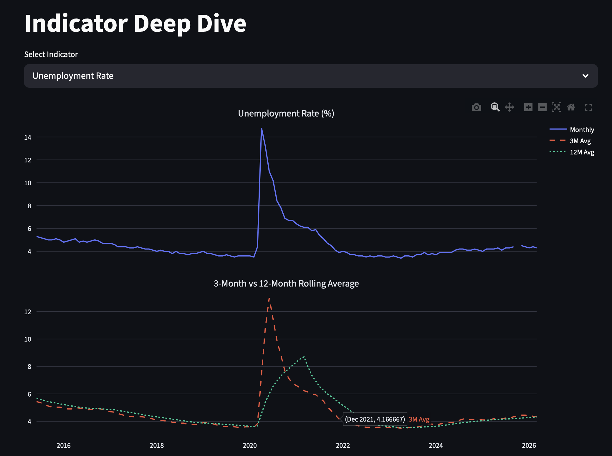
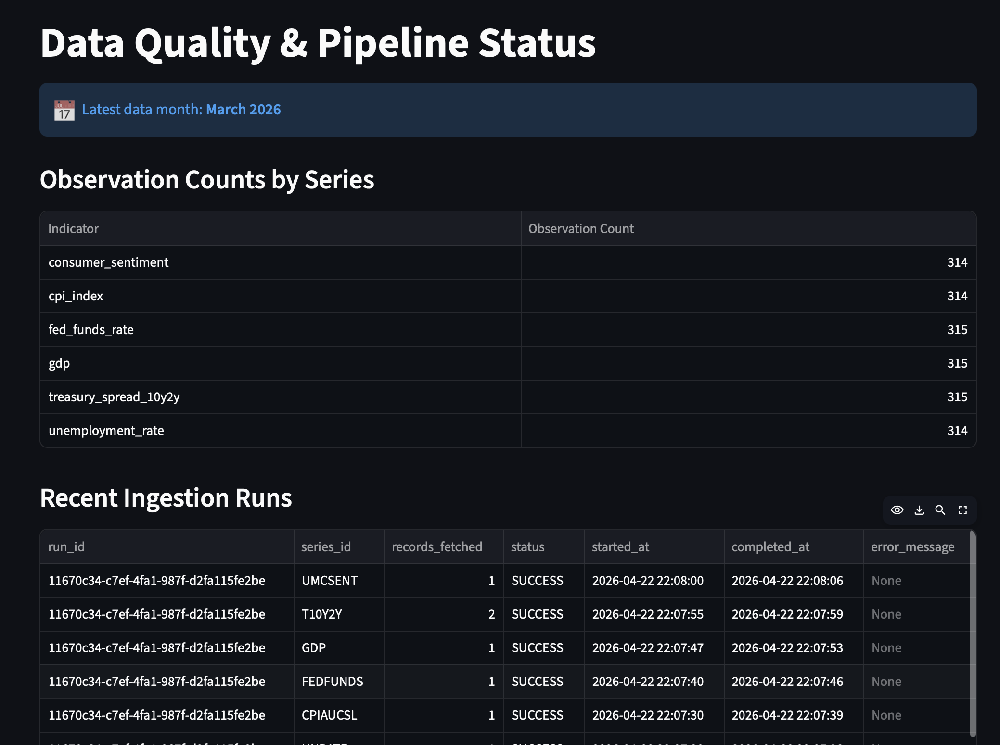
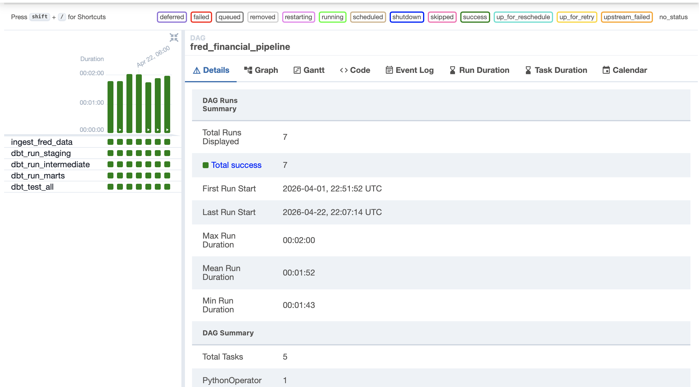
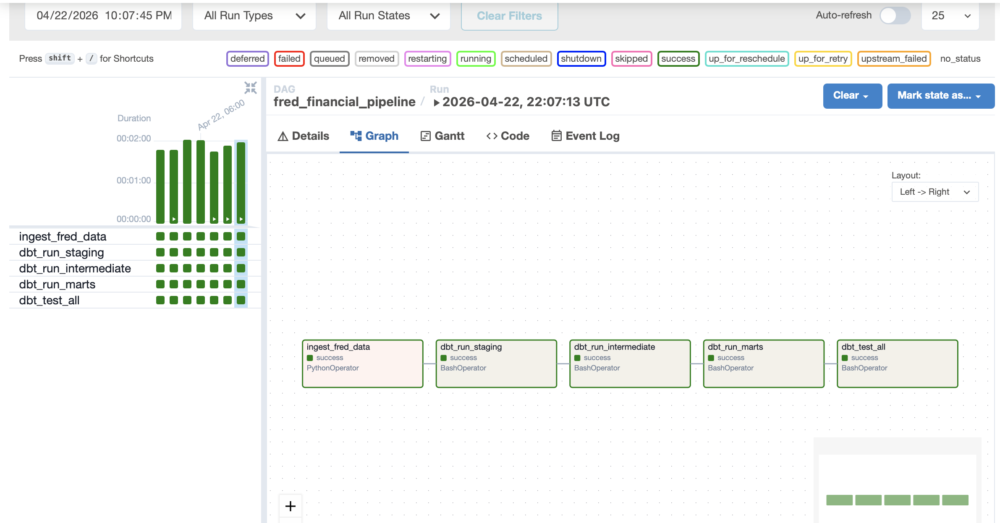

# FRED Financial Indicators Pipeline


An end-to-end analytics engineering pipeline that ingests U.S. economic
indicators from the Federal Reserve (FRED API), transforms them through a
multi-layer dbt architecture in Snowflake, orchestrates daily runs with
Airflow, and surfaces recession risk signals in a Streamlit dashboard.

---

## Why This Project

Built as a portfolio project to demonstrate the full analytics engineering
lifecycle — external API ingestion, orchestration, testing, and business-facing
visualization — on a real-world dataset where the domain itself is
differentiating. The economic-indicators use case combines a modern data stack
(Snowflake / dbt / Airflow / Streamlit) with financial domain modeling (Sahm
Rule, yield curve inversion, composite risk scoring) that's harder to fake than
a generic CRUD dataset.

---

## Dashboard Preview

### Economic Overview
Four KPI cards with month-over-month deltas, plus trend charts for each indicator.



### Recession Risk Monitor
Composite risk level driven by five established economic signals, with historical
signal count charted against HIGH / ELEVATED thresholds.



### Indicator Deep Dive
Monthly values with 3-month and 12-month rolling averages — visual basis for the
Sahm Rule calculation.



### Data Quality
Observation counts per series and the recent ingestion run log, populated from
the pipeline's own `RAW.INGESTION_LOG` table.



---

## Architecture

```
FRED API ──→ Python Ingestion ──→ Snowflake (RAW)
                                       │
                                       ▼
                              dbt Staging (clean, dedup)
                                       │
                                       ▼
                           dbt Intermediate (pivot, derive metrics,
                                            recession signals)
                                       │
                                       ▼
                              dbt Marts (dashboard-ready tables)
                                       │
                                       ▼
                             Streamlit Dashboard

                 ┌─────────────────────────────────────┐
                 │  Airflow orchestrates all steps     │
                 │  daily on a cron schedule           │
                 └─────────────────────────────────────┘
```

### Orchestration (Airflow)

Daily DAG running at 06:00 UTC. 5 tasks with per-task execution timeouts,
a failure callback extensible to Slack/PagerDuty, and task-level documentation
rendered in the UI.



*7 successful runs over 3 weeks, mean duration 1:52, zero failures.*



---

## Economic Indicators

| Series     | Indicator                  | Frequency | Why It Matters                                    |
|------------|----------------------------|-----------|---------------------------------------------------|
| UNRATE     | Unemployment Rate          | Monthly   | Primary labor market health metric                |
| CPIAUCSL   | Consumer Price Index       | Monthly   | Core inflation measurement                        |
| FEDFUNDS   | Federal Funds Rate         | Monthly   | Fed monetary policy stance                        |
| GDP        | Gross Domestic Product     | Quarterly | Broadest measure of economic output               |
| T10Y2Y     | 10Y-2Y Treasury Spread     | Daily     | Leading recession indicator (yield curve)         |
| UMCSENT    | Consumer Sentiment         | Monthly   | Forward-looking consumer confidence               |

---

## Recession Signal Model

The pipeline calculates five established recession indicators and produces a
composite risk score. Thresholds are configurable via dbt variables — see
`dbt_project.yml`.

| Signal                     | Rule                                                  | Economic Basis                                                    |
|----------------------------|-------------------------------------------------------|-------------------------------------------------------------------|
| **Sahm Rule**              | 3-mo avg unemployment rises ≥0.50pp above 12-mo low   | 100% historical accuracy identifying U.S. recessions (Sahm, 2019) |
| **Yield Curve Inversion**  | 10Y-2Y Treasury spread < 0                            | Has preceded every U.S. recession since 1970 (6-18 mo lead)       |
| **High Inflation**         | YoY CPI > 5%                                          | Often triggers aggressive Fed tightening that slows the economy   |
| **Low Consumer Sentiment** | University of Michigan index < 60                     | Signals consumer retrenchment and reduced spending                |
| **Fed Tightening**         | Fed funds rate YoY increase ≥1pp                      | Aggressive rate hikes historically precede downturns              |

**Composite Risk Levels:** LOW (0 signals) → MODERATE (1) → ELEVATED (2) → HIGH (3+)

---

## dbt Transformation Layers

### Staging (2 models)
- `stg_fred_observations` — Deduplicated, type-cast, NULL-filtered observations
- `stg_fred_metadata` — Cleaned series descriptions and metadata

### Intermediate (3 models)
- `int_economic_indicators_pivoted` — Long-to-wide pivot with frequency alignment
  (daily → monthly, quarterly → monthly via forward-fill)
- `int_indicators_with_changes` — Month-over-month changes, year-over-year changes,
  3-month and 12-month rolling averages, derived inflation and GDP growth rates
- `int_recession_signals` — Five recession warning signals with composite risk
  scoring; thresholds parameterized via dbt variables

### Marts (2 models)
- `mart_economic_dashboard` — Denormalized table joining all indicators, derived
  metrics, and signals for dashboard consumption
- `mart_indicator_summary` — Current snapshot with latest values, trends, and
  historical min/max/avg context

---

## Data Quality

### dbt Tests (23 total)

| Layer         | Test Count | Coverage                                                  |
|---------------|------------|-----------------------------------------------------------|
| Staging       | 9          | Uniqueness, not-null, accepted values on series IDs       |
| Intermediate  | 7          | Not-null on pivoted indicators and derived metrics        |
| Marts         | 5          | Referential integrity, not-null on dashboard fields       |
| Freshness     | 2          | Source freshness checks on RAW observations and metadata  |

### Python Tests (14 total)

14 pytest tests covering the ingestion script: value cleaning logic, FRED API
response parsing with mocked HTTP, retry behavior on transient errors, and CLI
argument parsing. Tests run in under a second with no credentials needed.

```bash
pytest                # Run Python tests
dbt test              # Run dbt tests (all 23)
```

---

## Key Design Decisions

- **MERGE-based upserts** over INSERT for idempotency — the pipeline can safely
  re-run without creating duplicates.
- **Three-layer dbt architecture** (staging → intermediate → marts) following
  analytics engineering best practices for separation of concerns.
- **Views for staging/intermediate, tables for marts** — balances data freshness
  against dashboard query performance.
- **Config-driven ingestion** — adding a new economic indicator requires one
  entry in the series config, no code changes.
- **Per-series error handling** — a failed API call for one series doesn't stop
  others from loading; the ingest task fails overall only if any series failed.
- **Forward-fill for mixed frequencies** — GDP (quarterly) is filled to monthly
  granularity for consistent cross-indicator analysis.
- **Configurable signal thresholds** — Sahm Rule, inflation, sentiment, and Fed
  tightening thresholds live in `dbt_project.yml` vars so they can be A/B tested
  without model changes.
- **Defensive dashboard formatting** — the dashboard renders `N/A` gracefully
  when the latest period has missing values (common for UMCSENT, which FRED
  publishes with a lag).

---

## What I'd Do Differently at Scale

These are the changes I'd make to take this from a well-built portfolio project
to a production pipeline at a company with real traffic:

### Orchestration
- Migrate from local Airflow + Docker to managed **Astronomer** or **Amazon MWAA**
  for auto-scaling, HA, and managed upgrades.
- Wire the `on_failure_callback` to **Slack** (via `SlackWebhookHook`) and
  **PagerDuty** for on-call rotation instead of just logging.
- Replace `BashOperator` + dbt CLI with **Cosmos** (astronomer-cosmos) so each
  dbt model becomes an individual Airflow task with its own lineage, retries, and
  per-model alerting.

### Data Warehouse
- Partition `RAW.FRED_OBSERVATIONS` by `observation_date` for query pruning.
- Convert marts from full-refresh tables to **incremental dbt models** once
  observation volumes grow past a few million rows.
- Add **dbt snapshots** on `FRED_SERIES_METADATA` to track slowly-changing
  attributes (units, seasonal adjustment revisions) over time.

### Schema & Contracts
- Define **dbt model contracts** (column names, types, constraints) on marts so
  downstream consumers get a stable interface.
- Add **dbt source freshness** thresholds that fail the pipeline if a series
  hasn't updated within its expected cadence.

### Observability
- Emit pipeline metrics (rows ingested, test pass rate, run duration) to
  **Datadog** or **Grafana** instead of only persisting them to `INGESTION_LOG`.
- Add **Great Expectations** or dbt `unit_tests` for statistical data quality
  (e.g., unemployment rate should always be between 0 and 25, not just non-null).

### Secrets & CI/CD
- Move credentials from `.env` to **AWS Secrets Manager** or **Airflow Variables**
  backed by a secrets backend.
- Add **GitHub Actions** CI: `dbt parse`, `dbt compile --target ci`, `pytest`,
  and SQL linting on every pull request.

### Testing
- Expand pytest coverage to the Snowflake loading functions with a local
  Snowflake mock or integration tests against a dedicated test warehouse.
- Add **dbt unit tests** for the recession-signal logic with synthetic fixture data
  covering each signal's trigger condition.

---

## Project Structure

```
fred-financial-pipeline/
├── README.md
├── LICENSE
├── requirements.txt
├── pytest.ini
├── docker-compose.yml             # Airflow (LocalExecutor) + PostgreSQL
├── .env.example                   # Credential template
├── .gitignore
├── dags/
│   ├── fred_pipeline_dag.py       # Airflow DAG with SLAs, callbacks, doc_md
│   └── scripts/
│       ├── __init__.py
│       └── ingest_fred.py         # FRED API → Snowflake ingestion
├── dbt_fred/
│   ├── dbt_project.yml            # Includes vars for recession thresholds
│   ├── packages.yml
│   ├── profiles.yml
│   ├── macros/
│   └── models/
│       ├── staging/               # 2 models — clean and dedup
│       ├── intermediate/          # 3 models — pivot, derive, signal
│       └── marts/                 # 2 models — dashboard-ready
├── streamlit/
│   └── app.py                     # 4-page interactive dashboard
├── snowflake/
│   └── setup.sql                  # DDL for raw tables
├── tests/
│   ├── conftest.py
│   └── test_ingest_fred.py        # 14 pytest tests
└── docs/
    └── images/                    # Screenshots referenced in README
```

---

## Setup & Installation

### Prerequisites

- Python 3.11+
- Docker & Docker Compose
- Snowflake account (free trial works)
- FRED API key (free at <https://fred.stlouisfed.org/docs/api/api_key.html>)

### 1. Clone and configure

```bash
git clone https://github.com/l1n9d/fred-financial-pipeline.git
cd fred-financial-pipeline
cp .env.example .env
# Edit .env with your FRED API key and Snowflake credentials
```

### 2. Set up Snowflake

Run `snowflake/setup.sql` in a Snowflake worksheet to create the database,
schemas, and raw tables.

### 3. Python environment and initial data load

```bash
python -m venv venv
source venv/bin/activate              # Windows: venv\Scripts\activate
pip install -r requirements.txt
python dags/scripts/ingest_fred.py    # Full historical load (from 2000-01-01)
```

Subsequent runs can use incremental mode to fetch only new observations:

```bash
python dags/scripts/ingest_fred.py --incremental
```

### 4. Run dbt transformations

```bash
set -a && source .env && set +a       # Load env vars into shell for dbt
cd dbt_fred
dbt deps
dbt run
dbt test                              # All 23 tests should pass
```

### 5. Start Airflow for scheduled runs

```bash
cd ..
docker compose up airflow-init
docker compose up -d
# Access UI at http://localhost:8080 (admin/admin)
```

### 6. Launch the dashboard

```bash
streamlit run streamlit/app.py
# Opens at http://localhost:8501
```

### 7. Run the test suite

```bash
pytest                                # 14 Python tests, runs in <1s
```

---

## Tech Stack

| Component       | Technology              | Purpose                                           |
|-----------------|-------------------------|---------------------------------------------------|
| Ingestion       | Python 3.11, requests   | Pull data from FRED REST API                      |
| Retry logic     | tenacity                | Exponential backoff on transient API errors       |
| Storage         | Snowflake               | Cloud data warehouse (RAW → STAGING → MARTS)      |
| Transformation  | dbt 1.11                | SQL modeling with testing and documentation       |
| Orchestration   | Apache Airflow 3.x      | Daily scheduled pipeline with task dependencies   |
| Visualization   | Streamlit, Plotly       | Interactive economic dashboard                    |
| Containerization| Docker Compose          | Local Airflow deployment                          |
| Testing         | pytest, pytest-mock     | Unit tests with mocked HTTP and Snowflake         |

---

## License

MIT — see [LICENSE](LICENSE).
